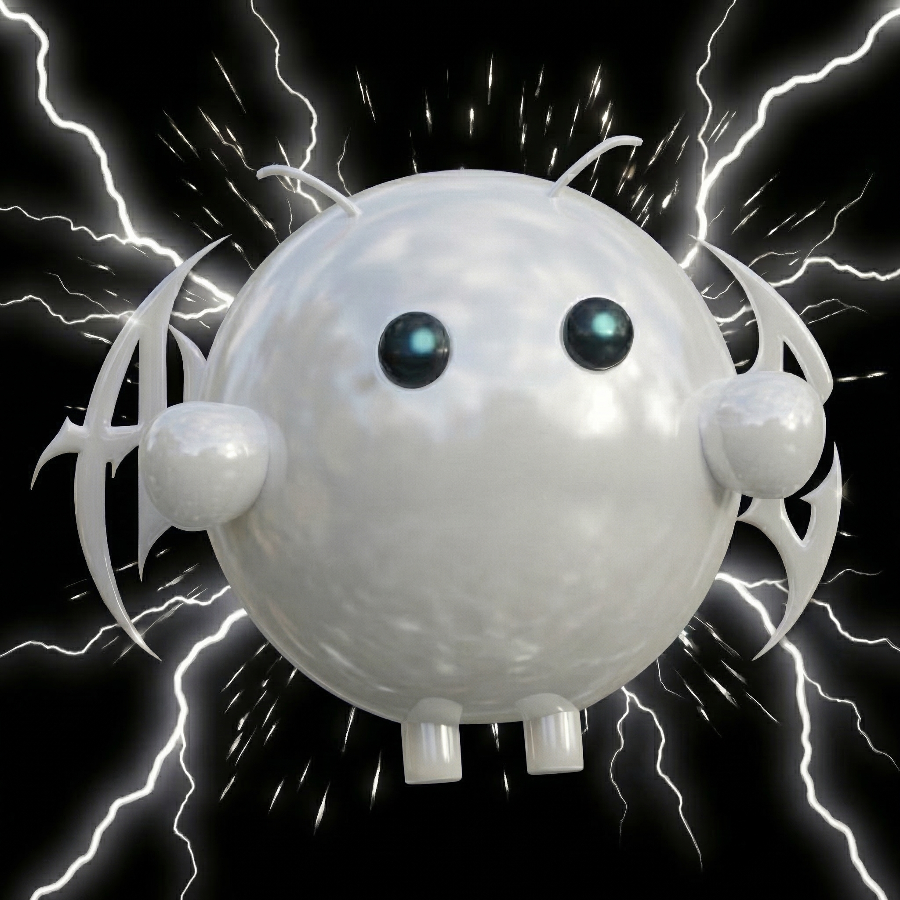
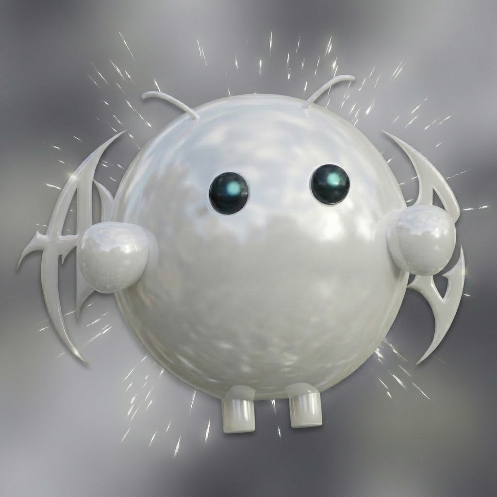

<div align="center">
  
  
  <h1>averatec-openclaw</h1>
  <p>Personal deployment of <a href="https://openclaw.ai">OpenClaw</a> — self-hosted AI gateway with multi-agent Discord setup, custom Docker image, Gmail, Google Places, and web search.</p>

  
  
  
  
</div>

---

## Overview

This repo documents my personal OpenClaw setup on a Hetzner VPS — including deployment notes, config references, and custom skills. It is **not** the OpenClaw source code; it is a knowledge base for managing and extending my own instance.

Two agents run on the same gateway: a private assistant (main) and a public-facing agent, each with its own Discord bot, workspace, and persona.

> Secrets live in `~/openclaw/.env` and `~/.openclaw/openclaw.json` on the server — never committed.

## What's Included

- **Multi-agent setup** — two agents (`main` + `public`) on one gateway, routed by Discord bot account via `bindings`
- **Custom Docker image** on top of `openclaw:latest`, adding `clawhub`, `gh`, `gog`, `goplaces`
- **Discord integration** — guild allowlist, no mention required, separate bot per agent
- **Web search** via Tavily API
- **Google Workspace** via OAuth (`gog`) — Gmail, Calendar, Drive
- **Google Places** search via `goplaces` CLI
- **Multi-model support** — Claude, GPT, Gemini, Mistral, Ollama and 15+ providers

## Skills

Custom skills for this instance are maintained in a separate repo:

**[averatec/averatec-skills](https://github.com/averatec0773/averatec-skills)** — personal OpenClaw skill library

Skills are installed via [ClawHub](skills/clawhub.md) into the running container. See [notes/skills.md](notes/skills.md) for workspace structure and file locations.

## Repository Structure

```
averatec-openclaw/
├── CONTEXT.md               # Full environment overview, paths, and current state
├── Dockerfile.custom        # Custom image definition (adds clawhub, gh, gog, goplaces)
├── docker-compose.yml       # Container configuration (references .env for secrets)
├── config/
│   └── openclaw.json        # Config template (secrets redacted)
├── installation/
│   └── setup.md             # Deployment guide — Hetzner VPS, Docker, initial setup
├── skills/
│   └── clawhub.md           # ClawHub CLI reference
├── notes/
│   ├── docker.md            # Image management and volume reference
│   ├── discord.md           # Discord channel config
│   ├── gog.md               # Google OAuth setup (headless server)
│   ├── models.md            # LLM provider reference
│   ├── skills.md            # Skills and workspace file structure
│   ├── ssh.md               # SSH alias and tunnel
│   ├── todo.md              # Known issues and future improvements
│   ├── updating.md          # Update procedure for Docker-based setup
│   └── workspace-files.md   # Workspace md file usage rules (AGENTS, SOUL, TOOLS, etc.)
├── templates/
│   ├── AGENTS.md            # AGENTS.md template (private agent)
│   ├── AGENTS.public.md     # AGENTS.md template (public agent)
│   ├── SOUL.md              # SOUL.md template (private agent)
│   ├── SOUL.public.md       # SOUL.md template (public agent)
│   ├── TOOLS.md             # TOOLS.md template
│   └── USER.md              # USER.md template
└── assets/
    ├── avatar-main.jpg      # Main agent avatar (private)
    └── avatar-public.jpg    # Public agent avatar
```

## Multi-Agent Setup

Two agents share one gateway instance, each bound to a separate Discord bot via `bindings` in `openclaw.json`:

| Agent | Bot | Workspace | Scope |
|---|---|---|---|
| `main` | Private bot (`accountId: default`) | `workspace/` | Owner DMs and private channels |
| `public` | Public bot (`accountId: public`) | `workspace-public/` | Guild messages, no shell access |

See [CONTEXT.md](CONTEXT.md) for full routing config and [notes/discord.md](notes/discord.md) for Discord channel options.

## Getting Started

Start with [CONTEXT.md](CONTEXT.md) for a full environment overview, then follow [installation/setup.md](installation/setup.md) for deployment steps.

## Related

- [OpenClaw Documentation](https://docs.openclaw.ai)
- [averatec-skills](https://github.com/averatec0773/averatec-skills) — my custom skill library
